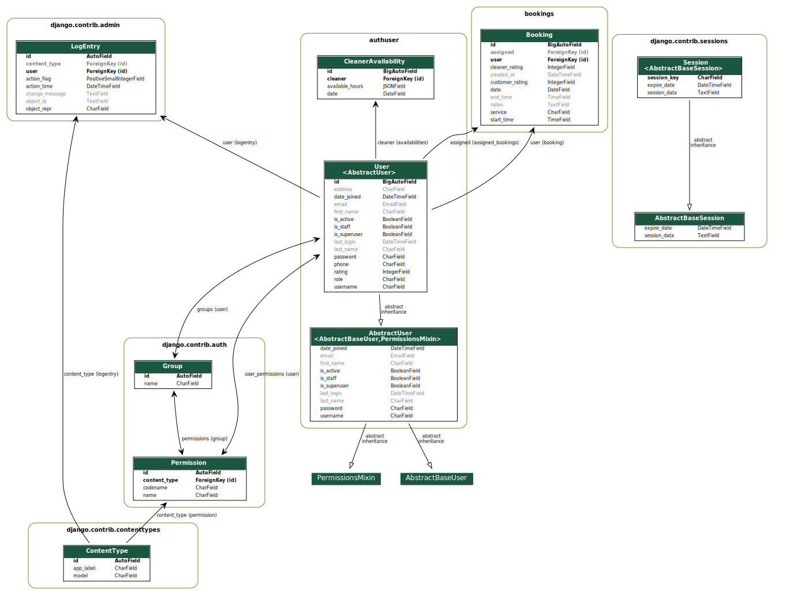
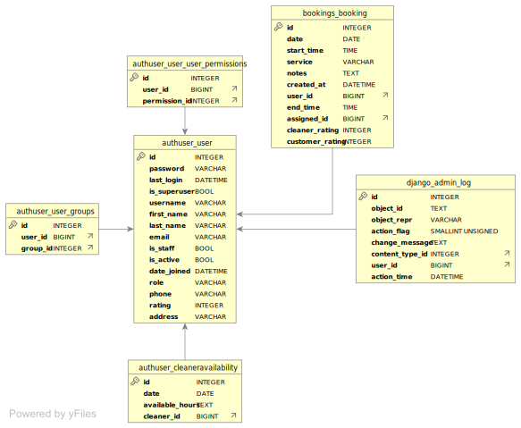

# Technical Information for Cleaning Website

## Development Tools
 - The main development tool used for this project is [Django](https://www.djangoproject.com/).
 - Then for the deployment of the site [AWS Elastic Beanstalk](https://aws.amazon.com/elasticbeanstalk/) was used.
 - The data for the website is stored in a MySQL database.

## Testing
For continuous integration automated testing was used, the details can be found below.
 - There are a few tests that we wrote which can be found in there respective test.py files.
 - These were made for cases where we are using custom behaviour.
 - The vast majority of the tests are automatically handled by Django itself.
 - The tests are ran when pull requests are made and when code is merged into the main branch.
 - This managed by the django.yml file in the workflows folder, or manually ran by running `python manage.py test`.

## Deployment Information
The continuous deployment is ran from the deploy.yml workflow in the .github folder.
It uses the following process:

### Process
- The workflow is triggered when files are merged to main.
- The src folder is cloned by the GitHub action.
- A Python environment is created with the dependancies in requirements.txt.
- The static files are collected into a separate folder.
- The source code and staticfiles are compressed into a zip file.
- The zip file is uploaded to an S3 Bucket.
- Then we use the AWS CLI to create a new application version in Elastic Beanstalk.
- Finally, the current environment is updated to the new application version.

## UML Class Diagram
Below is a UML Class Diagram of the website, the rounded boxes are the names of the python modules.

## ERD for the Database
Below is an ERD of the MySQL database.

