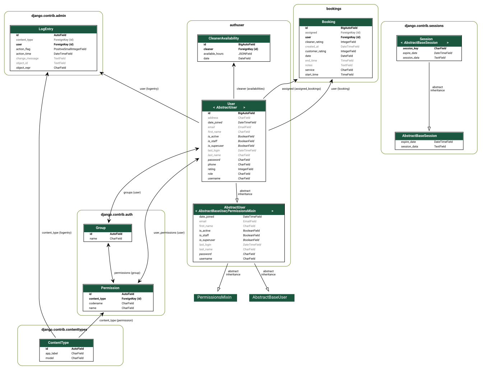
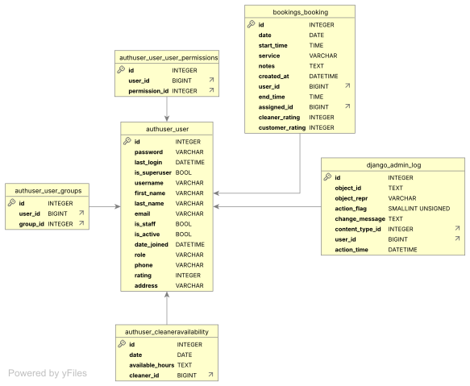

# Technical Information for Cleaning Website

## Development Tools
- The main development tool used for this project is [Django](https://www.djangoproject.com/), a high-level Python web framework.
- For deployment, we used [AWS Elastic Beanstalk](https://aws.amazon.com/elasticbeanstalk/), which automates environment creation, application versioning, and scaling.
- The data is stored in a MySQL database managed as part of the Elastic Beanstalk environment.

---

## Testing

For Continuous Integration (CI), we used GitHub Actions to automatically run tests when new code is pushed or pull requests are opened on the `main` branch. The link below shows all previous runs of the workflow and below that is a summary of the workflow.

### Testing Workflow: [Django CI GitHub Action](https://github.com/Nathan-Dachille/CP3407-Group-Project/actions/workflows/django.yml)

- The file `.github/workflows/django.yml` contains the setup for CI testing.
- It triggers on both `push` and `pull_request` events targeting the `main` branch.
- Python 3.12 is used to set up the environment.
- Dependencies are installed from `requirements.txt` located in the `src` folder.
- The tests are run using Django’s built-in test runner:  
- This checks the behaviour of the application, including the custom logic defined in our `test.py` files.
- Tests related to user stories can be found on the user stories pages (for the user stories that were completed).
- Most of the tests involve checking that the Django application is providing the correct content when a user accesses a page.
- Developers can run the tests locally with `python manage.py test`.

---

## Deployment Information

For Continuous Deployment (CD), we also used GitHub Actions, specifically the `deploy.yml` workflow which automates packaging and deployment to AWS Elastic Beanstalk. The hyperlink below takes you to a list of the previous runs of the deployment workflow.

### Deployment Workflow: [CI-CD pipeline to AWS GitHub Action](https://github.com/Nathan-Dachille/CP3407-Group-Project/actions/workflows/deploy.yml)

- The file `.github/workflows/deploy.yml` is triggered whenever code is pushed to the `main` branch.
- It consists of two jobs: `build` and `deploy`.

#### Build Job
- Clones the repo and checks out only the necessary files (`.github` and `src` folders).
- A Python virtual environment is created using version 3.12.
- Dependencies are installed via `pip` from the `requirements.txt` file.
- Static files (CSS, JavaScript, etc.) are collected with: `python manage.py collectstatic`.
- All source and static files are zipped into a file named using the GitHub commit SHA.
- The zip file is uploaded to an AWS S3 (Amazon Web Services Simple Storage Service) bucket using the AWS CLI.

#### Deploy Job
- Once the file is in S3, we create a new application version in AWS Elastic Beanstalk using the uploaded zip file.
- The environment is then updated to use this new version, with environment variables (e.g., `SECRET_KEY`) set securely using GitHub secrets.
- The deployment environment (`CP3407CleaningWebsite-env`) is managed entirely by Beanstalk, handling web server, application server, and database connectivity.
- Elastic Beanstalk performs actions in the environment based on the config files found in the `/src/.ebextensions` folder.

> In this project, Elastic Beanstalk was used to host our Django application with a managed MySQL database. It provided an easy way to scale, monitor, and manage the application lifecycle while keeping deployments automated via GitHub Actions.

---

## UML Class Diagram

Below is a UML Class Diagram of the website. The rounded boxes represent the names of the Python modules:

---

## ERD for the Database

Below is an Entity Relationship Diagram (ERD) of the MySQL database used by the Django backend:

